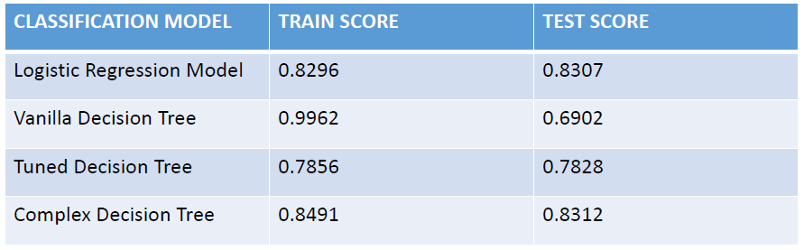

# **`PROJECT OVERVIEW`**

Mpox, just like covid 19 that affected the entire world in 2020,  is a new viral infection which can spread between people, mainly through close contact, and occasionally from the environment to people via things and surfaces that have been touched by a person with mpox (WHO, 2024). It is an illness caused by the monkeypox virus. 3 cases of Mpox at the time of writing this have been reported in Kenya but the vaccines for the disease are still under development.

The data for this research on uptake of vaccines based on opinions, demoraphics and doctor's recommendation is from United States National 2009 H1N1 Flu Survey collected to monitor vaccination rates during the US Government Vaccination Campaign that began in October 2009. A phone survey was used to ask people whether they had received H1N1 and seasonal flu vaccines, in conjunction with information they shared about their lives, opinions, and behaviors.

## **`DATA UNDERSTANDING`**

Here, the different sets of data as downloaded from the **`DRIVENDATA`** data repository are described:

## **`DESCRIPTION OF FEATURES AND LABELS`**

### **`FEATURES DATASET`**

The features dataset has 36 columns. The first column respondent_id is a unique and random identifier. The remaining 35 features are described below:

**For all binary variables**: 0 = No; 1 = Yes.

- **h1n1_concern** - Level of concern about the H1N1 flu.
0 = Not at all concerned; 1 = Not very concerned; 2 = Somewhat concerned; 3 = Very concerned.

- **h1n1_knowledge** - Level of knowledge about H1N1 flu.
0 = No knowledge; 1 = A little knowledge; 2 = A lot of knowledge.
- **behavioral_antiviral_meds** - Has taken antiviral medications. (binary)
- **behavioral_avoidance** - Has avoided close contact with others with flu-like symptoms. (binary)
- **behavioral_face_mask** - Has bought a face mask. (binary)
- **behavioral_wash_hands** - Has frequently washed hands or used hand sanitizer. (binary)
- **behavioral_large_gatherings** - Has reduced time at large gatherings. (binary)
- **behavioral_outside_home** - Has reduced contact with people outside of own household. (binary)
- **behavioral_touch_face**- Has avoided touching eyes, nose, or mouth. (binary)
- **doctor_recc_h1n1** - H1N1 flu vaccine was recommended by doctor. (binary)
- **doctor_recc_seasonal** - Seasonal flu vaccine was recommended by doctor. (binary)
- **chronic_med_condition** - Has any of the following chronic medical conditions: asthma or an other lung condition, diabetes, a heart condition, a kidney condition, sickle cell anemia or other anemia, a neurological or neuromuscular condition, a liver condition, or a weakened immune system caused by a chronic illness or by medicines taken for a chronic illness. (binary)
- **child_under_6_months** - Has regular close contact with a child under the age of six months. (binary)
- **health_worker**- Is a healthcare worker. (binary)
- **health_insurance**- Has health insurance. (binary)
- **opinion_h1n1_vacc_effective**- Respondent's opinion about H1N1 vaccine effectiveness.
1 = Not at all effective; 2 = Not very effective; 3 = Don't know; 4 = Somewhat effective; 5 = Very effective.
- **opinion_h1n1_risk** - Respondent's opinion about risk of getting sick with H1N1 flu without vaccine.
1 = Very Low; 2 = Somewhat low; 3 = Don't know; 4 = Somewhat high; 5 = Very high.
- **opinion_h1n1_sick_from_vacc** - Respondent's worry of getting sick from taking H1N1 vaccine.
1 = Not at all worried; 2 = Not very worried; 3 = Don't know; 4 = Somewhat worried; 5 = Very worried.
opinion_seas_vacc_effective - Respondent's opinion about seasonal flu vaccine effectiveness.
1 = Not at all effective; 2 = Not very effective; 3 = Don't know; 4 = Somewhat effective; 5 = Very effective.
- **opinion_seas_risk** - Respondent's opinion about risk of getting sick with seasonal flu without vaccine.
1 = Very Low; 2 = Somewhat low; 3 = Don't know; 4 = Somewhat high; 5 = Very high.
- **opinion_seas_sick_from_vacc** - Respondent's worry of getting sick from taking seasonal flu vaccine.
1 = Not at all worried; 2 = Not very worried; 3 = Don't know; 4 = Somewhat worried; 5 = Very worried.
- **age_group** - Age group of respondent.
- **education** - Self-reported education level.
- **race**- Race of respondent.
- **sex**- Sex of respondent.
- **income_poverty** - Household annual income of respondent with respect to 2008 Census poverty thresholds.
- **marital_status** - Marital status of respondent.
- **rent_or_own** - Housing situation of respondent.
- **employment_status** - Employment status of respondent.
- **hhs_geo_region**- Respondent's residence using a 10-region geographic classification defined by the U.S. Dept. of Health and Human Services. Values are represented as short random character strings.
- **census_msa** - Respondent's residence within metropolitan statistical areas (MSA) as defined by the U.S. Census.
- **household_adults** - Number of other adults in household, top-coded to 3.
- **household_children** - Number of children in household, top-coded to 3.
- **employment_industry** - Type of industry respondent is employed in. Values are represented as short random character strings.
- **employment_occupation** - Type of occupation of respondent. Values are represented as short random character strings.

### **`Labels Dataset`**

There are two target variables:

- **h1n1_vaccine** - Whether respondent received H1N1 flu vaccine.
- **seasonal_vaccine** - Whether respondent received seasonal flu vaccine.

Both are binary variables: 0 = No; 1 = Yes. Some respondents didn't get either vaccine, others got only one, and some got both. This is formulated as a multilabel (and not multiclass) problem.

## **`EXPLORATORY DATA ANALYSIS`**
#### Stacked bar chart to show correlation between h1n1_knowledge and h1n1 flu vaccine uptake

##### The bar chart shows high correlation between knowledge of h1n1 vaccine and h1n1_vaccine.

#### selected columns against the two target variables

## **`MODELLING`**
The models were developed using Logistic Regression Model and Decision Tree Classifier (ID3) Models.
In Logistic Regression, two target variables were used, that is seasonal_vaccine and h1n1 vaccine.
The rest of the models used only target variable.

### AUC curve for Logistic Regression

### **Comments on Logistic Regression**

- From the scores (83.14%) it is evident that based on the information that was shared about people's backgrounds, opinions and health behaviours, people took H1N1 and Seasonal Flue Vaccines.
- It therefore implies that a persons background, Opinion and Health Behaviour affect the uptake of a vaccine.
- The model performance is good but it is not perfect since it has an 83% performance out of the total 100%

To test whether the a different model would perform better, a Decision Tree Classification Model (ID3) will be developed.

### AUC curve for Vanilla Decision Tree Model

### Comments on Vanilla

- The model performance using the decision tree is lower compaired to the performance of the Logistic Regression Model.
- The score roc_auc is 69% whereas the score in the Logistic Regression is 83%.
- This might be because the number of features selected in the Logistic Regression Model were higher compaired to the features selected for Decision Tree.
- The difference in score might also be caused by overfitting in the desion tree.
- To solve the overfitting problem, tree prunning / hyperparameter tuning will be done in the next model

### AUC curve for Tuned Decision Tree Model

### Comments on Tuned Model
- The model has significantly improved (73% performance score) compaired to the Vanilla decision tree model (69% performance score) that was not prunned.
- The Logistic Regression Model that had two target variables still performs better (83% performance score) compaired to the two Decision Tree models.
- This might be attributed to the size of the Logistic Regression Model that had a higher number of Features compaired to the features selected for Decision Tree.

### AUC curve for Complex Decision Tree Model

#### Comments on Model 4 Performance

- The performance of the model has significantly improved (83% auc_roc score) compaired to the second and third models which were both decision tree models but had a performance of 69% and 78% respectively.
- This improvement in performance is attributed to the use of more features and the use of correct depth limit achieved through hyperparameter tuning.
- The model however, has thesame performance when compaired to the Logistic Regression model that had a performance score of 83% despite model four having more features than the Logistic Regression Model.
- To further improve the performance of the Decision Tree Classifier, other tree prunning methods like (minimum samples with leaf split, minimum leaf sample size, maximum leaf nodes, and maximum features) can be used instead of using miaximum depth alone.

### Comparing performance of different models

- The performance of the Vanilla Decision Tree Classifier is 99% on Train data and 69% on test data indicating that the Vanilla/baseline model for decision tree is overfitted.
- The rest of the models 

## **`FINDINGS AND RECOMMENDATIONS`**

### **`FINDINGS`**
1. Logistic Regression Model has an average roc_auc score of 83.07% indicating that the model performs well in predicting H1N1 and Seasonal Flu Vaccines uptake.
2. The Vanilla Decision Tree Model has an roc_auc score of 69% which is a poor performance compaired to the logistic regression model. This indicate that use of less variables without hypeperameter tuning results to poor model performance in Decision Trees.
3. The tuned decision tree using similar features as the Vanilla model had a n roc_auc score of 78% indicating that proper prunning of decision tree can lead to good performance of a model.
4. The tuned decision tree that was developed using an optimal depth with more three more features (`sex`, `race` and `age_group`) compaired to the logistic regression that had only 23 features performed better than all the models  (roc_auc of 83.12%). This indicate that with proper tuning and increasing the number features the model ca perform better in predicting vaccines.

### **`Recommendations`**
1. When performing hypeparameter tuning for the decision tree classifier, only the Maximum Depth was used. To improve the performance of the Decision Tree Classifier, other tree prunning methods like (minimum samples with leaf split, minimum leaf sample size, maximum leaf nodes, and maximum features) can be used instead of using miaximum depth alone.
2. The decision tree classifier used only one target variable (seasonal_vaccine). Both outcomes can be included in the decision tree model to determine whether the model performance will improve.

